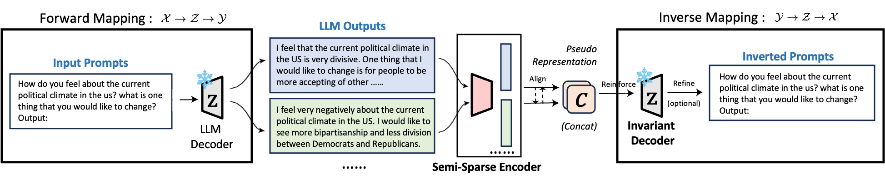

<div align="center">

<h2>An Invariant Latent Space Perspective on Language Model Inversion</h2>

</div>


## Preliminary

**Datasets:** The datasets we used is located in the `datas/` directory.

**Usage:** To get started, install this command.

```bash
pip install -e .
```

## Training

To train the model with the same hyperparameters as in the paper, run the following command (We take `alpaca` dataset as example):

```bash
deepspeed --include localhost:0 train.py \
    --train_dataset_path data/alpaca_full_train.json \
    --encoder_model_name t5-base \
    --decoder_model_name llama2 \
    --do_contrastive_learning True \
    --contrastive_learning_train_epoch 4 \
    --contrastive_learning_learning_rate 1e-5 \
    --fine_tuning_train_epoch 1 \
    --fine_tuning_learning_rate 2e-4 \
    --model_save_path "MODEL_SAVE_PATH" \
    --seed 42 \
    --task user
```

## Inference
To run prompt inversion inference with our inversion model, run the following command (We take `alpaca` dataset as example):
```bash
python inference.py \
    --inference_dataset_path data/alpaca_full_test.json \
    --encoder_model_name t5-base \
    --encoder_model_path "ENCODER_MODEL_PATH" \
    --decoder_model_name llama2 \
    --projector_model_path "PROJECTOR_MODEL_PATH" \
    --max_inversion_tokens 128 \
    --result_save_path "RESULT_SAVE_PATH"
```

## Reproduce 

To reproduce our results in the paper, run the following command:
```bash
python experiments.py main_result [--api_key "API_KEY"]
```
If you want to CS or GPT score in the paper, please provide an openai api key.
